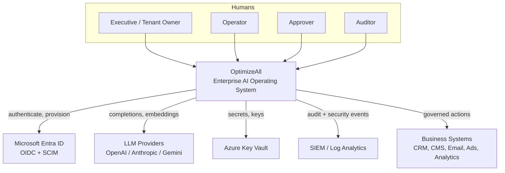
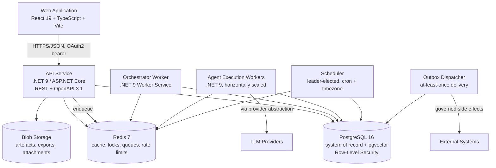

# OptimizeAll — System Architecture

- **Document ID:** OA-ARC-001
- **Version:** 1.0
- **Supersedes:** none

---

## 1. Architectural drivers

The architecture is shaped by five forces, in priority order:

1. **Governability.** Every autonomous action must be attributable, reversible where possible,
   and blockable by a human. This is the reason the platform exists; it outranks performance.
2. **Isolation.** A defect in tenant A must be incapable of exposing tenant B's data. Isolation is
   enforced in the database, not in application code alone.
3. **Provider independence.** LLM vendors change pricing, availability, and terms. No vendor type
   may leak past the Infrastructure boundary.
4. **Durability of long-running work.** Agent runs take minutes to hours. Process restarts,
   deployments, and node loss must not lose or duplicate work.
5. **Auditability over convenience.** When a design choice trades an audit guarantee for developer
   ergonomics, the audit guarantee wins.

---

## 2. C4 Level 1 — System context



---

## 3. C4 Level 2 — Containers



### 3.1 Container responsibilities

| Container | Responsibility | Scaling | State |
|---|---|---|---|
| Web Application | Presentation only. No business rules. | CDN + static hosting | none |
| API Service | AuthN/Z, validation, use-case execution, read models | Horizontal, stateless | none |
| Orchestrator | Workflow advancement, task assignment, gate insertion | Horizontal, partitioned by workspace | DB |
| Agent Workers | Execute one agent run at a time to completion | Horizontal, queue-driven | DB + Redis lease |
| Scheduler | Convert cron schedules into due occurrences | Single active leader, hot standby | DB + Redis lock |
| Outbox Dispatcher | Deliver external side effects exactly-once-effectively | Horizontal, partitioned | DB |

**Why separate orchestrator and agent workers.** An agent run is long, expensive, and may block on
an approval that takes hours. Workflow advancement is short and must stay responsive. Coupling them
would let one slow agent starve every workflow in the workspace.

---

## 4. C4 Level 3 — Backend layering (Clean Architecture)

```
┌──────────────────────────────────────────────────────────────┐
│  OptimizeAll.Api            OptimizeAll.Worker               │  Composition
│  (HTTP, auth, filters)      (hosted services, queues)        │  root
└──────────────┬───────────────────────────┬───────────────────┘
               │                           │
┌──────────────▼───────────────────────────▼───────────────────┐
│  OptimizeAll.Infrastructure                                  │  Adapters
│  EF Core · Npgsql · Redis · Key Vault · LLM providers        │
│  Implements ports declared by Application                    │
└──────────────┬───────────────────────────────────────────────┘
               │
┌──────────────▼───────────────────────────────────────────────┐
│  OptimizeAll.Application                                     │  Use cases
│  Commands · Queries · Handlers · Ports · Policies            │
│  Pipeline: validation → authorisation → tenancy → txn → audit│
└──────────────┬───────────────────────────────────────────────┘
               │
┌──────────────▼───────────────────────────────────────────────┐
│  OptimizeAll.Domain            OptimizeAll.SharedKernel      │  Enterprise
│  Aggregates · Invariants · Domain events · Value objects     │  rules
│  Zero infrastructure dependencies                            │
└──────────────────────────────────────────────────────────────┘
```

**Dependency rule.** Dependencies point inward only. `Domain` references nothing but
`SharedKernel`. `Application` references `Domain`. `Infrastructure` references `Application`.
`Api` and `Worker` reference `Infrastructure` for composition only.

This is enforced by `OptimizeAll.Architecture.Tests`, which fails the build on violation. A comment
in a README is not enforcement; a failing test is.

### 4.1 Bounded contexts

| Context | Aggregate roots | Core invariants |
|---|---|---|
| **Tenancy** | `Tenant`, `Workspace` | A workspace belongs to exactly one tenant, forever. Environments are fixed at creation. |
| **Access** | `User`, `Role` | A role assignment is always scoped; permissions cannot be granted beyond the granter's own set. |
| **AgentCatalog** | `AgentDefinition` | A published version is immutable. Tool grants are a closed set. |
| **Execution** | `AgentRun` | A run has exactly one terminal state. Budgets are checked before, not after, each step. |
| **Orchestration** | `WorkflowRun` | The task graph is acyclic. A task starts only when all predecessors succeed. |
| **Governance** | `ApprovalRequest`, `ApprovalPolicy` | Requester ≠ approver. Payload hash at approval must equal payload hash at execution. |
| **Audit** | `AuditEvent` | Append-only, hash-chained per tenant. |
| **Knowledge** | `KnowledgeDocument` | Retrieval is scoped to (tenant, workspace, environment). |
| **Scheduling** | `ScheduleDefinition` | One logical occurrence fires once, regardless of worker count. |
| **Insights** | `KpiSnapshot` | Snapshots are immutable facts at a point in time. |

### 4.2 Application pipeline

Every command passes through an ordered pipeline of behaviours:

```
Request
  → CorrelationBehaviour      assign/propagate correlation id
  → ValidationBehaviour       FluentValidation, fail fast with 400
  → TenantResolutionBehaviour bind tenant/workspace/environment context
  → AuthorizationBehaviour    permission check against the resolved scope
  → BudgetBehaviour           reject if the scope is over budget
  → TransactionBehaviour      open transaction, set RLS session variable
  → Handler                   the actual use case
  → DomainEventBehaviour      dispatch domain events raised in the transaction
  → OutboxBehaviour           persist external effects to the outbox
  → AuditBehaviour            write the audit event and extend the hash chain
Response
```

Ordering is deliberate. Authorisation runs **after** tenant resolution (you cannot authorise
against an unknown scope) and **before** any transaction is opened (an unauthorised request must
never touch data). Audit runs last so it records the true outcome, including failures.

---

## 5. Multi-tenancy and environment isolation

Three isolation mechanisms operate together; each is independently sufficient to stop the common
case, and together they cover each other's failure modes.

1. **Ambient scope.** `ITenantContext` is resolved once per request from the validated token and is
   immutable thereafter. Handlers cannot widen it.
2. **Query filters.** EF Core global query filters add `tenant_id = @current` to every read of a
   tenant-owned entity. Guards against forgetting a `WHERE` clause.
3. **Row-Level Security.** Every transaction issues `SET LOCAL app.tenant_id`. PostgreSQL policies
   reject rows outside that tenant. Guards against an ORM bypass, a raw SQL mistake, or a
   compromised application-layer check.

Environment isolation (`Development` / `Staging` / `Production`) rides the same three mechanisms
with an additional column. A Production credential is never materialisable in a Development
context, because the secret reference itself is keyed by the triple.

**Explicit escalation.** Platform operators occasionally need cross-tenant reads. This is available
only through a distinct code path that requires a platform-scope token, emits a `PlatformEscalation`
audit event before the query runs, and is time-boxed. There is no flag that quietly disables RLS.

---

## 6. AI provider abstraction

```
Application layer                Infrastructure layer
─────────────────                ────────────────────
IChatCompletionService  ◄──────  OpenAiChatCompletionService
IEmbeddingService       ◄──────  AnthropicChatCompletionService
                        ◄──────  GeminiChatCompletionService
                                       │
                        ResilientChatCompletionService (decorator)
                          · retry with jittered backoff
                          · circuit breaker per provider
                          · failover to secondary
                          · token + cost metering
                          · PII redaction before persistence
```

The Application layer speaks only in `ChatRequest` / `ChatResponse` / `ToolDefinition` — types owned
by OptimizeAll. Swapping OpenAI for Anthropic is a configuration change, not a code change.

**Model policy resolution order:** agent definition override → workspace default → tenant default →
platform default. The resolved provider and model are recorded on the run, so a completion is always
reproducible in principle.

---

## 7. Agent execution model

```mermaid
sequenceDiagram
    participant O as Orchestrator
    participant Q as Redis Queue
    participant W as Agent Worker
    participant P as Provider Layer
    participant A as Approval Service
    participant DB as PostgreSQL

    O->>DB: create Task (Pending)
    O->>Q: enqueue run request
    W->>Q: dequeue + acquire lease
    W->>DB: load AgentDefinition version + memory
    loop bounded reasoning loop
        W->>P: chat completion (tools advertised)
        P-->>W: response or tool call
        alt tool requires approval
            W->>A: raise ApprovalRequest (payload hash)
            W->>DB: run → AwaitingApproval, release lease
            Note over W,A: run suspends; worker is free
            A-->>W: decision resumes the run
        else tool is auto-executable
            W->>W: authorise against grants, execute, record
        end
        W->>DB: persist step, tokens, cost
    end
    W->>DB: run → Succeeded/Failed, emit domain events
    W->>O: signal task completion
```

Key properties:

- **Suspension is free.** A run awaiting approval holds no worker and no connection. It is a database
  state, resumed by an event. This is what makes hour-long approval waits affordable.
- **Leases, not locks.** A worker holds a Redis lease with a TTL and renews it via heartbeat. A dead
  worker's lease expires and the run is safely reclaimed. No manual intervention.
- **Budgets are pre-checked.** Cost and token limits are evaluated before each provider call, not
  after. An agent cannot overspend and apologise.

---

## 8. Approval integrity

The central guarantee: **what a human approved is exactly what executes.**

1. When an agent proposes a sensitive action, the platform canonicalises the payload
   (RFC 8785 JSON Canonicalisation) and computes `payload_hash = SHA-256(canonical_json)`.
2. The approval request stores the payload, the hash, the estimated cost/reach, and the lineage.
3. The approver sees the rendered payload and decides.
4. At execution time, the payload is re-canonicalised and re-hashed. If it differs from the approved
   hash by a single byte, execution is refused and a security event is raised.

This defeats time-of-check/time-of-use substitution, including one caused by an agent re-generating
its own payload after approval.

Additional controls: requester ≠ approver (enforced in the domain, not the UI); agents can never
approve; approvals expire and fail closed; a workspace-level kill switch is checked immediately
before every external effect.

---

## 9. Audit chain

Each audit event stores `previous_hash` and `entry_hash`, where

```
entry_hash = SHA-256(previous_hash ‖ canonical_json(event_without_hashes))
```

per tenant. Inserts are serialised per tenant by an advisory lock. A nightly job walks each chain
and raises a Critical alert on the first discontinuity. Application roles hold `INSERT` and `SELECT`
on the audit table and nothing else; `UPDATE` and `DELETE` are not granted to any role the
application can assume.

---

## 10. Reliability patterns

| Concern | Pattern |
|---|---|
| DB commit vs external side effect diverging | Transactional outbox; dispatcher delivers after commit |
| Duplicate delivery | Idempotency keys persisted per external operation |
| Provider outage | Circuit breaker + failover + queue retention |
| Poison message | Bounded retries → dead-letter queue → operator alert |
| Worker death mid-run | Redis lease TTL + heartbeat; expired lease reclaimed |
| Schedule fired twice | Unique constraint on (schedule_id, occurrence_utc) |
| Thundering herd on cache miss | Single-flight via Redis lock |
| Runaway agent | Hard budget, iteration cap, wall-clock cap, kill switch |

---

## 11. Technology decisions

| Decision | Choice | Rationale |
|---|---|---|
| Database | PostgreSQL 16 | RLS is a first-class isolation primitive; `pgvector` avoids a second datastore for embeddings. |
| Mediation | Hand-rolled dispatcher | Removes a licence-volatile dependency from the core; the pipeline is ~150 lines and fully owned. |
| Vector store | `pgvector` in the same cluster | One backup, one restore, one RLS policy. Revisit above ~50M chunks per tenant. |
| Queue | Redis Streams | Already required for cache and locks; consumer groups give at-least-once with acknowledgement. |
| Runtime | Azure Container Apps | Managed scale-to-zero for workers, KEDA queue scaling, no Kubernetes operational burden. |
| Frontend data | TanStack Query | Server state is not client state; caching, retry, and invalidation are solved problems. |
| Assertions | xUnit built-ins | Avoids assertion libraries with recently changed licence terms. |

Each is recorded as an ADR under `docs/adr/`.

---

## 12. Deliberate non-goals for v1.0

- **No microservice-per-context.** The contexts are separated by module boundary and enforced by
  architecture tests, deployed as two processes (API, Worker). Splitting further before there is a
  scaling or team-topology reason would buy distributed-transaction problems for nothing.
- **No event sourcing.** The audit chain provides the forensic guarantee that event sourcing is
  usually reached for, at a fraction of the operational cost.
- **No custom model hosting.** Provider-agnostic by design; hosting is a separate business.
