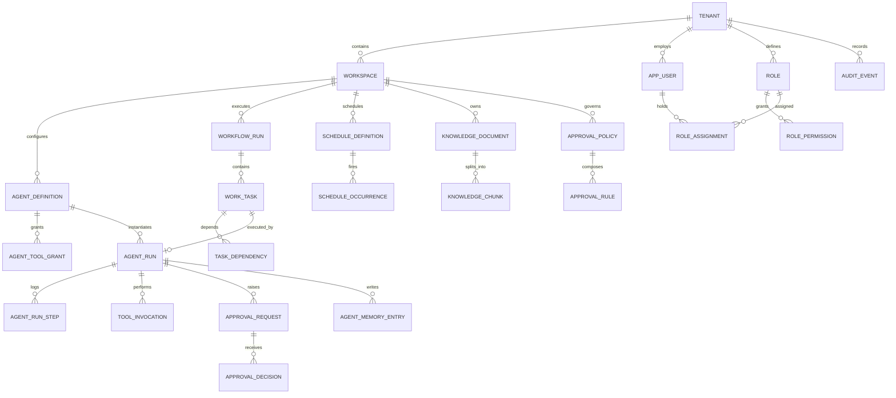

# OptimizeAll — Data Model

- **Document ID:** OA-DAT-001
- **Version:** 1.0
- **Physical target:** PostgreSQL 16 + `pgvector`

The authoritative schema lives in `backend/src/OptimizeAll.Infrastructure/Persistence/Migrations`.
This document explains the model and the reasoning behind its constraints.

---

## 1. Conventions

| Convention | Rule | Reason |
|---|---|---|
| Primary keys | `uuid` generated as UUIDv7 in the application | Time-ordered for index locality; leaks no row counts |
| Tenant scoping | `tenant_id uuid NOT NULL` on every tenant-owned table | Precondition for Row-Level Security |
| Timestamps | `timestamptz`, always UTC | Ambiguity in local time is a defect source |
| Money | `numeric(19,4)` + `char(3)` ISO-4217 currency | Floating point money is a correctness bug |
| Soft delete | `deleted_at timestamptz NULL` | Recoverability; audit continuity |
| Concurrency | `version integer NOT NULL DEFAULT 0` on aggregate roots | Optimistic concurrency, no lost updates |
| Naming | `snake_case` tables and columns, singular table names | Consistent with PostgreSQL idiom |
| Enums | Stored as `text` with a `CHECK` constraint | Cheaper to evolve than PostgreSQL enum types |
| JSON | `jsonb`, always with a documented shape | Indexable, validated at the application boundary |

**Every** tenant-owned table carries this footer, omitted from the listings below for brevity:

```sql
tenant_id     uuid        NOT NULL REFERENCES tenant(id),
created_at    timestamptz NOT NULL DEFAULT now(),
created_by    uuid        NULL,
updated_at    timestamptz NULL,
updated_by    uuid        NULL,
deleted_at    timestamptz NULL,
version       integer     NOT NULL DEFAULT 0
```

---

## 2. Entity relationship overview



---

## 3. Tenancy

### `tenant`
| Column | Type | Notes |
|---|---|---|
| `id` | uuid PK | |
| `slug` | citext UNIQUE | URL-safe identifier |
| `display_name` | text NOT NULL | |
| `status` | text NOT NULL | `Provisioning`\|`Active`\|`Suspended`\|`PendingDeletion` |
| `region` | text NOT NULL | Data residency pin |
| `plan_code` | text NOT NULL | Commercial plan |
| `settings` | jsonb NOT NULL | Tenant-level defaults |
| `purge_after` | timestamptz NULL | Set when `PendingDeletion` |

`tenant` is the isolation root. It has no `tenant_id` of its own.

### `workspace`
| Column | Type | Notes |
|---|---|---|
| `id` | uuid PK | |
| `slug` | citext | UNIQUE `(tenant_id, slug)` |
| `display_name` | text NOT NULL | |
| `default_environment` | text NOT NULL | `Development`\|`Staging`\|`Production` |
| `budget_cap` | numeric(19,4) NULL | Monthly AI spend cap |
| `budget_currency` | char(3) NOT NULL | |
| `kill_switch_engaged` | boolean NOT NULL DEFAULT false | Halts all agent execution |
| `settings` | jsonb NOT NULL | |

**Why `kill_switch_engaged` lives here.** It must be readable in a single cheap query immediately
before any external effect. Putting it behind a settings blob or a remote flag service would make
the check expensive enough that someone would eventually cache it — and a cached kill switch is not
a kill switch.

---

## 4. Access control

### `app_user`
| Column | Type | Notes |
|---|---|---|
| `id` | uuid PK | |
| `external_subject` | text | OIDC `sub`. UNIQUE `(tenant_id, external_subject)` |
| `email` | citext NOT NULL | UNIQUE `(tenant_id, email)` |
| `display_name` | text NOT NULL | |
| `status` | text NOT NULL | `Invited`\|`Active`\|`Suspended`\|`Deprovisioned` |
| `last_login_at` | timestamptz NULL | |
| `preferences` | jsonb NOT NULL | |

### `role`
| Column | Type | Notes |
|---|---|---|
| `id` | uuid PK | |
| `key` | text | UNIQUE `(tenant_id, key)` |
| `display_name` | text NOT NULL | |
| `is_builtin` | boolean NOT NULL | Built-in roles are immutable |
| `description` | text NOT NULL | |

### `role_permission`
| Column | Type | Notes |
|---|---|---|
| `role_id` | uuid FK | |
| `permission` | text NOT NULL | `resource:action`, e.g. `approval:decide` |

PK `(role_id, permission)`.

### `role_assignment`
| Column | Type | Notes |
|---|---|---|
| `id` | uuid PK | |
| `principal_id` | uuid NOT NULL | user or agent principal |
| `principal_type` | text NOT NULL | `User`\|`Agent`\|`ServiceClient` |
| `role_id` | uuid FK NOT NULL | |
| `workspace_id` | uuid FK NULL | NULL = tenant-wide |
| `environment` | text NULL | NULL = all environments |
| `granted_by` | uuid NOT NULL | |
| `expires_at` | timestamptz NULL | Time-boxed grants |

UNIQUE `(principal_id, role_id, workspace_id, environment)`.

**Scoped grants are the point.** A Production approver is not automatically a Development approver,
and vice versa. Modelling scope as nullable columns rather than separate tables keeps the
authorisation query a single index seek.

### Built-in roles

| Role key | Purpose | Notable permissions |
|---|---|---|
| `platform.operator` | Runs the SaaS | `tenant:provision`, `platform:escalate` |
| `tenant.owner` | Accountable executive | All tenant permissions incl. `approval:decide:financial` |
| `tenant.administrator` | Configuration | `role:manage`, `agent:configure`, `policy:manage` |
| `tenant.approver` | Sign-off authority | `approval:decide` |
| `tenant.operator` | Day-to-day | `workflow:create`, `task:read`, `agent:invoke` |
| `tenant.analyst` | Reporting | `kpi:read`, `report:read`, `analytics:read` |
| `tenant.auditor` | Oversight, read-only | `audit:read`, `approval:read`, `run:read` |

---

## 5. Agent catalog and execution

### `agent_definition`
| Column | Type | Notes |
|---|---|---|
| `id` | uuid PK | |
| `workspace_id` | uuid FK NOT NULL | |
| `agent_key` | text NOT NULL | e.g. `seo-agent` |
| `definition_version` | integer NOT NULL | UNIQUE `(workspace_id, agent_key, definition_version)` |
| `status` | text NOT NULL | `Draft`\|`Published`\|`Deprecated` |
| `display_name` | text NOT NULL | |
| `mission` | text NOT NULL | |
| `system_prompt` | text NOT NULL | |
| `input_schema` | jsonb NOT NULL | JSON Schema |
| `output_schema` | jsonb NOT NULL | JSON Schema |
| `model_policy` | jsonb NOT NULL | provider, model, temperature, fallbacks |
| `memory_policy` | jsonb NOT NULL | tiers enabled, retention, redaction |
| `budget_policy` | jsonb NOT NULL | max tokens, max cost, max tool calls, max wall-clock |
| `approval_policy_id` | uuid FK NULL | |
| `max_risk_class` | text NOT NULL | Ceiling on what this agent may propose |
| `kpi_definitions` | jsonb NOT NULL | |
| `published_at` | timestamptz NULL | |

**A published version is immutable.** Editing produces version `n+1`. Enforced by a database
trigger, because "we all agreed not to update published rows" is not a control.

### `agent_tool_grant`
| Column | Type | Notes |
|---|---|---|
| `agent_definition_id` | uuid FK | |
| `tool_key` | text NOT NULL | |
| `constraints` | jsonb NOT NULL | Per-grant limits, e.g. domain allow-list |

PK `(agent_definition_id, tool_key)`. Absence of a row is denial.

### `agent_run`
| Column | Type | Notes |
|---|---|---|
| `id` | uuid PK | |
| `agent_definition_id` | uuid FK NOT NULL | Exact version executed |
| `workspace_id` | uuid FK NOT NULL | |
| `environment` | text NOT NULL | |
| `task_id` | uuid FK NULL | |
| `status` | text NOT NULL | `Queued`\|`Running`\|`AwaitingApproval`\|`Succeeded`\|`Failed`\|`Cancelled`\|`TimedOut`\|`BudgetExceeded` |
| `trigger_type` | text NOT NULL | `Manual`\|`Schedule`\|`Workflow`\|`Event` |
| `triggered_by` | uuid NULL | |
| `input` | jsonb NOT NULL | |
| `output` | jsonb NULL | |
| `error` | jsonb NULL | Structured, never a bare string |
| `provider` | text NULL | Provider actually used |
| `model` | text NULL | Model actually used |
| `prompt_tokens` | bigint NOT NULL DEFAULT 0 | |
| `completion_tokens` | bigint NOT NULL DEFAULT 0 | |
| `cost_amount` | numeric(19,4) NOT NULL DEFAULT 0 | |
| `cost_currency` | char(3) NOT NULL DEFAULT 'USD' | |
| `iteration_count` | integer NOT NULL DEFAULT 0 | |
| `started_at` | timestamptz NULL | |
| `completed_at` | timestamptz NULL | |
| `lease_holder` | text NULL | Worker instance id |
| `lease_expires_at` | timestamptz NULL | Reclamation point |
| `correlation_id` | uuid NOT NULL | |
| `is_dry_run` | boolean NOT NULL DEFAULT false | |

Index: `(workspace_id, status, lease_expires_at)` for reclamation sweeps;
`(workspace_id, created_at DESC)` for the run list.

### `agent_run_step`
Ordered reasoning trace: `(run_id, sequence)` PK, `step_type`
(`Prompt`\|`Completion`\|`ToolCall`\|`ToolResult`\|`Retrieval`\|`Decision`\|`Error`), `content jsonb`,
`tokens`, `latency_ms`, `occurred_at`.

### `tool_invocation`
| Column | Type | Notes |
|---|---|---|
| `id` | uuid PK | |
| `agent_run_id` | uuid FK NOT NULL | |
| `tool_key` | text NOT NULL | |
| `risk_class` | text NOT NULL | Class at invocation time |
| `arguments` | jsonb NOT NULL | Redacted per policy |
| `result` | jsonb NULL | |
| `status` | text NOT NULL | `Authorised`\|`Denied`\|`AwaitingApproval`\|`Executed`\|`Failed`\|`Skipped` |
| `denial_reason` | text NULL | |
| `approval_request_id` | uuid FK NULL | |
| `idempotency_key` | text NULL | UNIQUE per `(tenant_id, tool_key, idempotency_key)` |
| `duration_ms` | integer NULL | |

### `agent_memory_entry`
| Column | Type | Notes |
|---|---|---|
| `id` | uuid PK | |
| `agent_key` | text NOT NULL | Memory follows the agent, not the version |
| `workspace_id` | uuid FK NOT NULL | |
| `environment` | text NOT NULL | |
| `tier` | text NOT NULL | `Episodic`\|`Semantic` |
| `source_run_id` | uuid FK NULL | |
| `content` | text NOT NULL | |
| `embedding` | vector(1536) NULL | |
| `importance` | real NOT NULL DEFAULT 0.5 | |
| `outcome_signal` | text NULL | `Approved`\|`Rejected`\|`Revised`\|`Succeeded`\|`Failed` |
| `expires_at` | timestamptz NULL | Retention |

Index: HNSW on `embedding`, plus `(workspace_id, agent_key, environment, tier)`.

**Why memory keys on `agent_key` and not `agent_definition_id`.** Learning must survive a
definition version bump. Otherwise every prompt tweak would amnesiac the agent.

---

## 6. Orchestration

### `workflow_run`
| Column | Type | Notes |
|---|---|---|
| `id` | uuid PK | |
| `workspace_id` | uuid FK NOT NULL | |
| `environment` | text NOT NULL | |
| `objective_title` | text NOT NULL | |
| `objective_payload` | jsonb NOT NULL | |
| `status` | text NOT NULL | `Planning`\|`Running`\|`AwaitingApproval`\|`Succeeded`\|`Failed`\|`Cancelled` |
| `plan` | jsonb NOT NULL | The generated DAG |
| `estimated_cost` | numeric(19,4) NULL | |
| `actual_cost` | numeric(19,4) NOT NULL DEFAULT 0 | |
| `deadline` | timestamptz NULL | |
| `correlation_id` | uuid NOT NULL | |

### `work_task`
| Column | Type | Notes |
|---|---|---|
| `id` | uuid PK | |
| `workflow_run_id` | uuid FK NOT NULL | |
| `sequence` | integer NOT NULL | |
| `title` | text NOT NULL | |
| `assigned_agent_key` | text NULL | |
| `status` | text NOT NULL | `Pending`\|`Ready`\|`Running`\|`AwaitingApproval`\|`Succeeded`\|`Failed`\|`Skipped`\|`Blocked` |
| `input` | jsonb NOT NULL | |
| `output` | jsonb NULL | |
| `attempt_count` | integer NOT NULL DEFAULT 0 | |
| `max_attempts` | integer NOT NULL DEFAULT 3 | |
| `heartbeat_at` | timestamptz NULL | Stall detection |
| `blocked_reason` | text NULL | |

### `task_dependency`
`(task_id, depends_on_task_id)` PK, plus `dependency_type` (`Completion`\|`Approval`\|`Data`).
A `BEFORE INSERT` trigger rejects any edge that would introduce a cycle — the acyclicity invariant is
enforced in the database because a cyclic plan would deadlock the orchestrator permanently.

---

## 7. Governance

### `approval_policy` / `approval_rule`
| Column | Type | Notes |
|---|---|---|
| `id` | uuid PK | |
| `workspace_id` | uuid FK NOT NULL | |
| `key` | text NOT NULL | |
| `is_active` | boolean NOT NULL | |

`approval_rule`: `policy_id`, `risk_class`, `tool_key NULL`, `threshold_amount NULL`,
`threshold_currency NULL`, `required_role_key`, `required_approver_count`, `expiry_minutes`,
`allow_self_approval boolean NOT NULL DEFAULT false` (a `CHECK` constraint pins this to `false`
whenever `risk_class` is `External`, `Financial`, or `Irreversible`).

### `approval_request`
| Column | Type | Notes |
|---|---|---|
| `id` | uuid PK | |
| `workspace_id` | uuid FK NOT NULL | |
| `environment` | text NOT NULL | |
| `agent_run_id` | uuid FK NULL | |
| `tool_invocation_id` | uuid FK NULL | |
| `risk_class` | text NOT NULL | |
| `title` | text NOT NULL | |
| `payload` | jsonb NOT NULL | Exactly what will execute |
| `payload_hash` | char(64) NOT NULL | SHA-256 of RFC 8785 canonical JSON |
| `estimated_impact` | jsonb NOT NULL | cost, reach, reversibility |
| `requested_by_principal` | uuid NOT NULL | |
| `requested_by_type` | text NOT NULL | `User`\|`Agent` |
| `required_approver_count` | integer NOT NULL DEFAULT 1 | |
| `status` | text NOT NULL | `Pending`\|`Approved`\|`Rejected`\|`Expired`\|`Cancelled` |
| `expires_at` | timestamptz NOT NULL | |
| `resolved_at` | timestamptz NULL | |

### `approval_decision`
`id`, `approval_request_id`, `approver_user_id`, `decision` (`Approve`\|`Reject`),
`rationale text` (`CHECK`: non-empty when `decision = 'Reject'`), `decided_at`,
`step_up_verified boolean NOT NULL`.

UNIQUE `(approval_request_id, approver_user_id)` — one decision per approver.

A `CHECK`-backed trigger enforces `approver_user_id <> requested_by_principal`. Self-approval is
blocked in the database, not merely in the service layer, because that constraint is the one most
likely to be bypassed by a future "just this once" code path.

### `audit_event`
| Column | Type | Notes |
|---|---|---|
| `id` | uuid PK | |
| `tenant_id` | uuid NOT NULL | |
| `sequence` | bigint NOT NULL | UNIQUE `(tenant_id, sequence)` |
| `occurred_at` | timestamptz NOT NULL | |
| `actor_id` | uuid NULL | |
| `actor_type` | text NOT NULL | `User`\|`Agent`\|`System`\|`ServiceClient` |
| `action` | text NOT NULL | `approval.decided`, `agent.run.started`, … |
| `resource_type` | text NOT NULL | |
| `resource_id` | uuid NULL | |
| `workspace_id` | uuid NULL | |
| `environment` | text NULL | |
| `outcome` | text NOT NULL | `Success`\|`Failure`\|`Denied` |
| `before_state` | jsonb NULL | |
| `after_state` | jsonb NULL | |
| `metadata` | jsonb NOT NULL | |
| `correlation_id` | uuid NOT NULL | |
| `ip_address` | inet NULL | |
| `previous_hash` | char(64) NOT NULL | |
| `entry_hash` | char(64) NOT NULL | |

No `updated_at`, no `deleted_at`, no `version` — this table is append-only by design. The
application database role is granted `INSERT` and `SELECT` only. Partitioned monthly by
`occurred_at`.

---

## 8. Knowledge

### `knowledge_document`
`id`, `workspace_id`, `environment`, `title`, `source_uri`, `source_type`, `content_hash char(64)`,
`status` (`Ingesting`\|`Active`\|`Deprecated`\|`Failed`), `metadata jsonb`, `ingested_at`,
`expires_at`. UNIQUE `(workspace_id, environment, content_hash)` prevents duplicate ingestion.

### `knowledge_chunk`
`id`, `document_id`, `workspace_id`, `environment`, `sequence`, `content text`,
`embedding vector(1536)`, `token_count`, `metadata jsonb`.

HNSW index on `embedding` with `vector_cosine_ops`. **Retrieval always filters
`(tenant_id, workspace_id, environment)` before the vector search**, so an approximate-nearest-
neighbour index can never surface another tenant's chunk.

---

## 9. Scheduling, messaging, insights

### `schedule_definition`
`id`, `workspace_id`, `environment`, `key`, `cron_expression`, `timezone` (IANA), `target_type`
(`Agent`\|`Workflow`), `target_key`, `payload jsonb`, `miss_policy`
(`Skip`\|`RunOnceOnRecovery`\|`BackfillAll`), `is_enabled`, `next_occurrence_utc`,
`last_occurrence_utc`.

### `schedule_occurrence`
`id`, `schedule_id`, `occurrence_utc`, `dispatched_at`, `status`, `run_id`.
UNIQUE `(schedule_id, occurrence_utc)` — this single constraint is what makes exactly-once firing
true across an arbitrary number of scheduler replicas.

### `outbox_message`
`id`, `tenant_id`, `occurred_at`, `message_type`, `payload jsonb`, `status`
(`Pending`\|`Dispatched`\|`Failed`\|`DeadLettered`), `attempt_count`, `next_attempt_at`,
`last_error`, `idempotency_key`. Index `(status, next_attempt_at)`.

### `notification`
`id`, `tenant_id`, `recipient_user_id`, `category`, `severity`, `title`, `body`, `link_url`,
`channels text[]`, `read_at`, `delivered_at`, `delivery_status jsonb`.

### `kpi_snapshot`
`id`, `workspace_id`, `environment`, `kpi_key`, `period_start`, `period_end`, `granularity`,
`value numeric(19,4)`, `unit`, `dimensions jsonb`, `computed_at`.
UNIQUE `(workspace_id, environment, kpi_key, period_start, granularity, dimensions)`.

Snapshots are immutable facts. Recomputation writes a new row with a later `computed_at`; the
dashboard reads the latest. Overwriting history would make yesterday's executive report
irreproducible.

---

## 10. Row-Level Security

Applied to every tenant-owned table:

```sql
ALTER TABLE <t> ENABLE ROW LEVEL SECURITY;
ALTER TABLE <t> FORCE ROW LEVEL SECURITY;

CREATE POLICY tenant_isolation ON <t>
  USING (tenant_id = current_setting('app.tenant_id', true)::uuid)
  WITH CHECK (tenant_id = current_setting('app.tenant_id', true)::uuid);
```

`FORCE` matters: without it the table owner bypasses the policy, and the migration role is usually
the owner. Every transaction issues `SET LOCAL app.tenant_id = $1` before any statement.
`SET LOCAL` — not `SET` — so the value cannot leak to the next borrower of a pooled connection.

Platform-operator cross-tenant access uses a separate database role holding `BYPASSRLS`, reachable
only through the audited escalation path.

---

## 11. Retention

| Data | Retention | Basis |
|---|---|---|
| Audit events (`Financial`) | 7 years | Statutory |
| Audit events (other) | 3 years | Policy |
| Agent runs and steps | 13 months hot, then cold archive | Cost vs investigation need |
| Prompts and completions | 90 days, then hash-only | Minimisation |
| Knowledge chunks | Until deprecated | Business need |
| Notifications | 180 days | Utility |
| KPI snapshots | Indefinite | Small, historically valuable |

Erasure requests remove personal data from `app_user`, `agent_memory_entry`, `knowledge_chunk`, and
run payloads, while preserving audit events in a pseudonymised form. The audit record of *what
happened* survives; the personal data *within* it does not. That split is what makes the two
obligations compatible.
