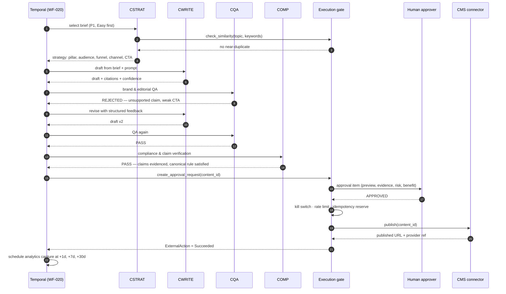
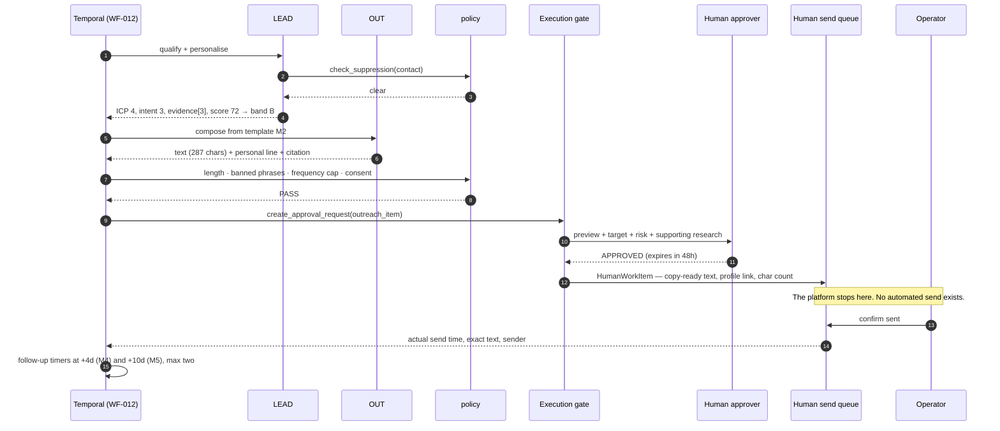
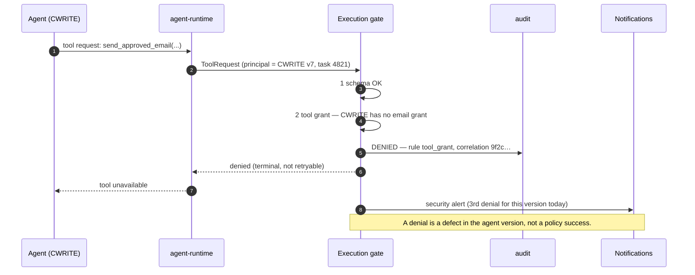
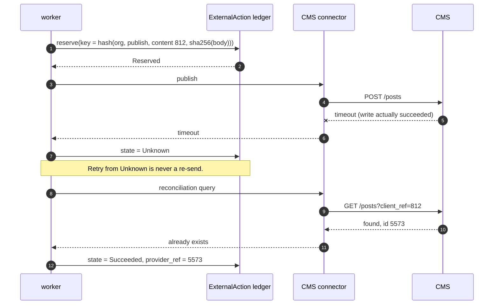
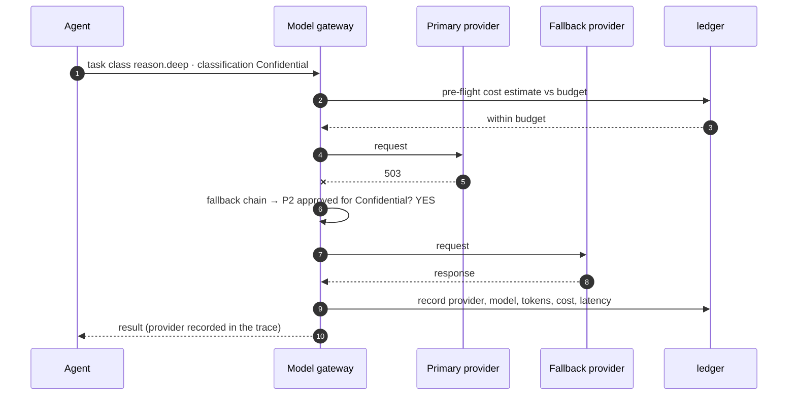
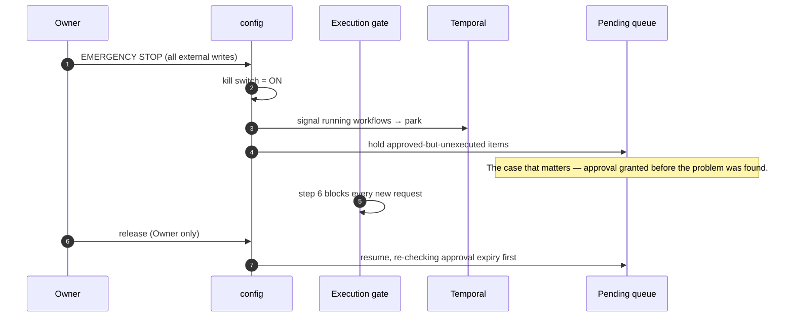
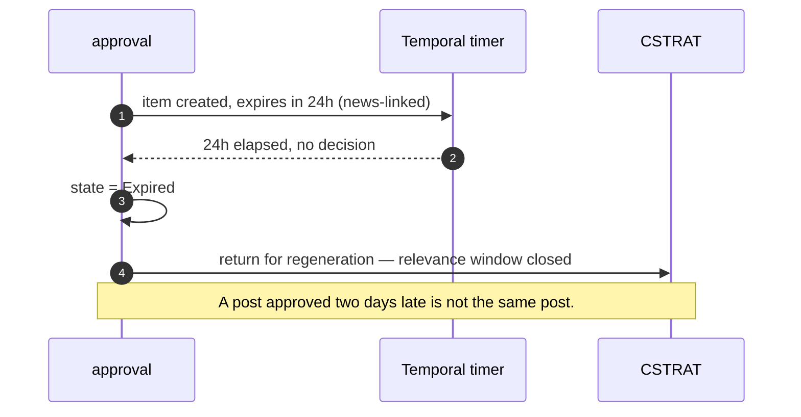
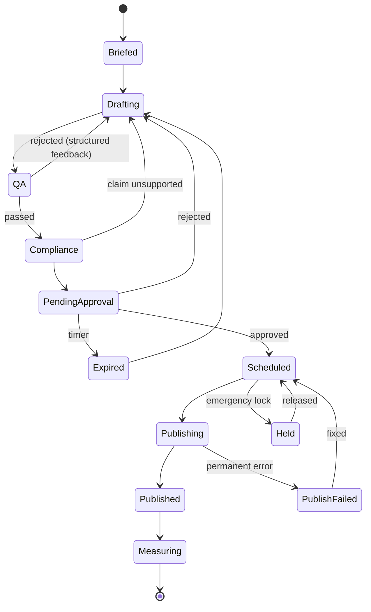
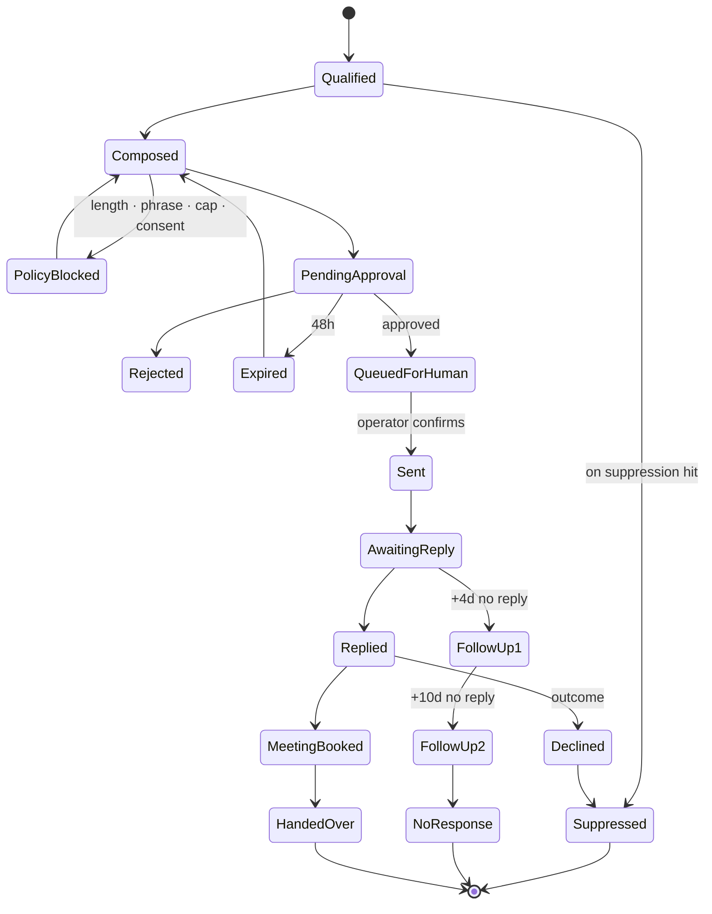
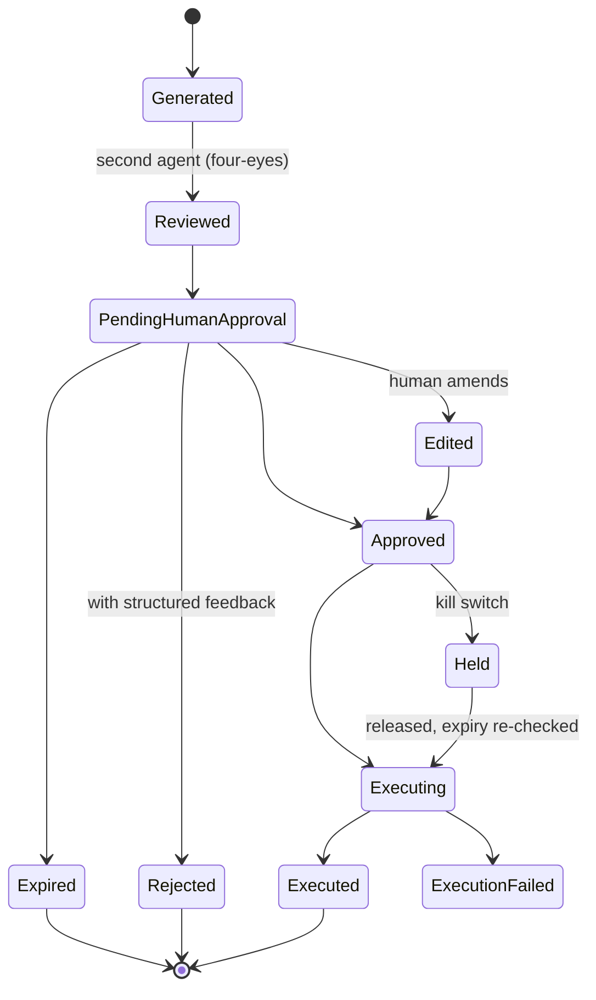

# 13 — Sequence & Workflow Diagrams

Seven sequences and three workflow state machines. Each shows a mechanism the prose cannot convey compactly: where the boundary is crossed, what state a request moves through, and what happens when it goes wrong.

## 13.1 Content production — the full governed loop, including a QA rejection

The QA rejection is drawn deliberately: it is `AC-02`, and a loop that has never been exercised is a loop that does not work.

## 13.2 Outreach preparation — where the platform stops

Step 15 is the architectural point: the confirmation, not the approval, starts the timers — anchoring them to the event rather than the record (`WF-021`).

## 13.3 The execution gate rejecting an unauthorised tool

## 13.4 Publish timeout — why a retry cannot duplicate

Connectors that cannot support a reconciliation query declare it in the manifest; their `Unknown` actions require human confirmation rather than a blind retry.

## 13.5 Model provider fallback under data classification

If P2 were **not** approved for the payload's classification it is skipped, not used, and the task queues for the primary's recovery — alerting if deadline-critical (`AI-062`).

## 13.6 Emergency stop catching an approved-but-unexecuted item

## 13.7 Approval expiry on a news-linked post

---

## 13.8 Workflow state machines

### Content item

### Outreach item

Two transitions carry the workbook's rules directly: `FollowUp2 → NoResponse` enforces the hard maximum of two follow-ups, and `Declined → Suppressed` is permanent and irreversible without an audited administrative act.

### Approval item

`Approved → Held` is the state that makes `FR-112` real: without it, emergency stop would catch only work that had not yet been approved, which is the wrong half.
